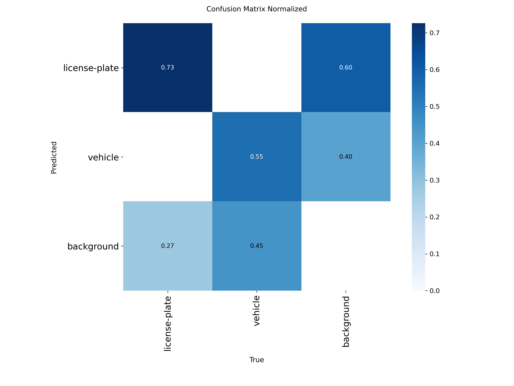
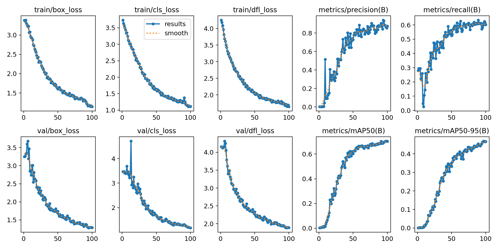
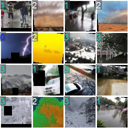
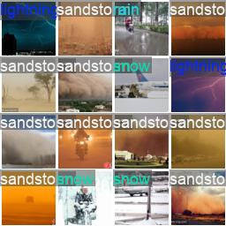
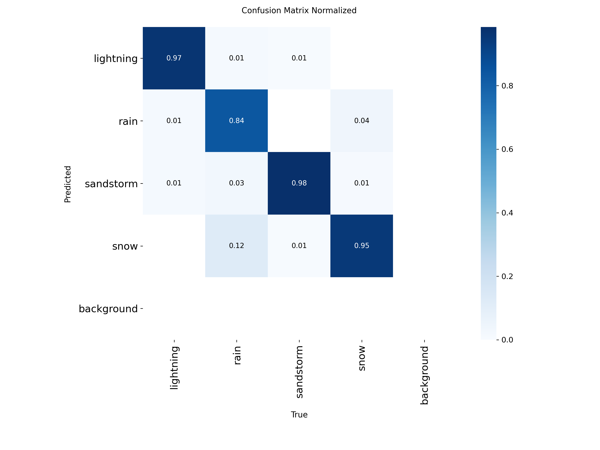
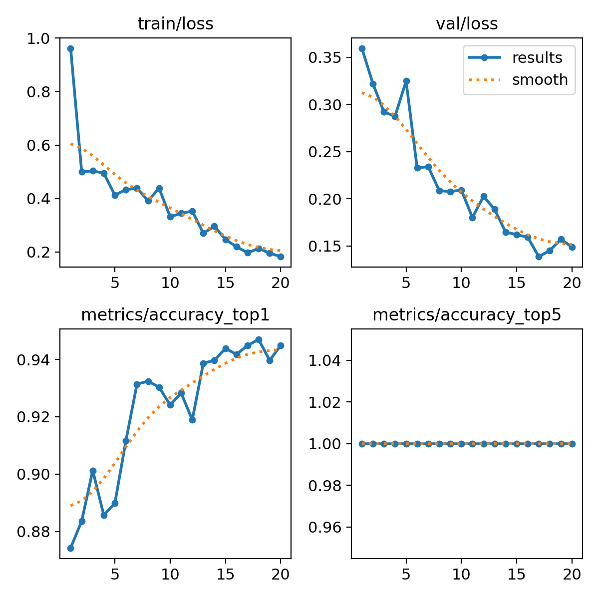
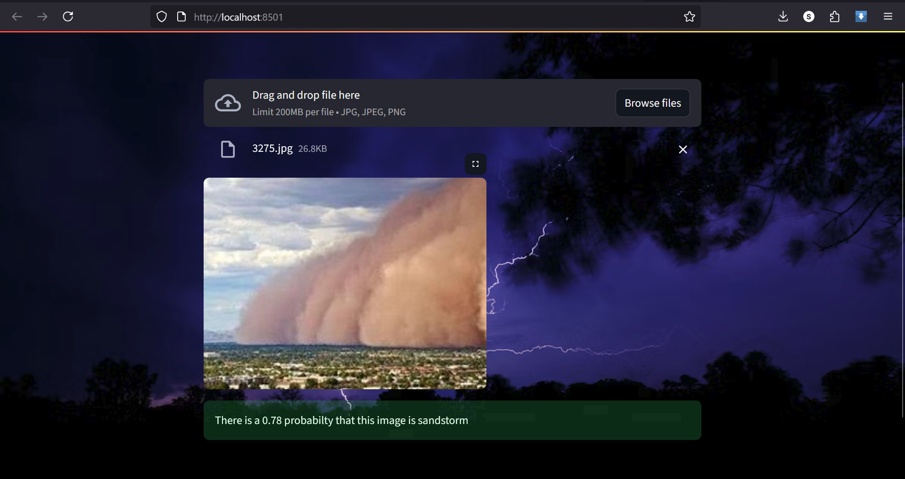
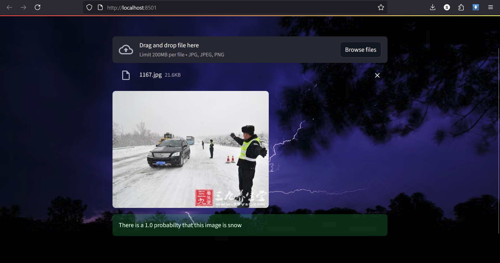

# 🚗 Object Detection (YOLO)

This project is about a trained _Yolo11n_ model for **vehicle number plate and vehicle detection** and for this project I downloaded the dataset from **Roboflow**.

---

## 👁️ Demo

<table>
  <tr>
    <td style="text-align:center;">
      
      <div><strong>traning</strong></div>
    </td>
    <td style="text-align:center;">
      
      <div><strong>Validation</strong></div>
    </td>
  </tr>
</table>
<table>
  <tr>
    <td style="text-align:center;">
      
      <div><strong>Confusion matrix</strong></div>
    </td>
    <td style="text-align:center;">
      
      <div><strong>losses</strong></div>
    </td>
  </tr>
</table>

---

# 🖼️ Image Classification (YOLO)

This project demonstrates _YOLO11n-CLS_ trained for an **image classification task**.  
The task involves classifying images into four categories ( `lightning`, `rain`, `sandstorm`, `snow`).

Dataset Source: [Open Images Dataset – Vehicle Number Plates](https://www.kaggle.com/datasets/jehanbhathena/weather-dataset)

---

## 👁️ Demo

<table>
  <tr>
    <td style="text-align:center;">
      
      <div><strong>Training Samples</strong></div>
    </td>
    <td style="text-align:center;">
      
      <div><strong>Validation Predictions</strong></div>
    </td>
  </tr>
</table>

<table>
  <tr>
    <td style="text-align:center;">
      
      <div><strong>Confusion Matrix</strong></div>
    </td>
    <td style="text-align:center;">
      
      <div><strong>losses</strong></div>
    </td>
  </tr>
</table>

---

## ☃️🌧️🌩️ YOLO Image Classifier App

<table>
  <tr>
    <td style="text-align:center;">
      
      <div><strong></strong></div>
    </td>
    <td style="text-align:center;">
      
      <div><strong></strong></div>
    </td>
  </tr>
</table>

---

## 🧱 Requirements

```bash
pip install -r requirements.txt
```

---

## ▶️ Run the App

```bash
streamlit run predict.py
```

Then open in your browser:

```
http://localhost:8501
```

---

## 🖼️ Workflow

1. Start the app.
2. Upload an image from testimages folder.
3. The app:
   - Resizes the image to `400x300` for display.
   - Passes it through the YOLO model.
   - Shows the uploaded image with predicted class and probability.
