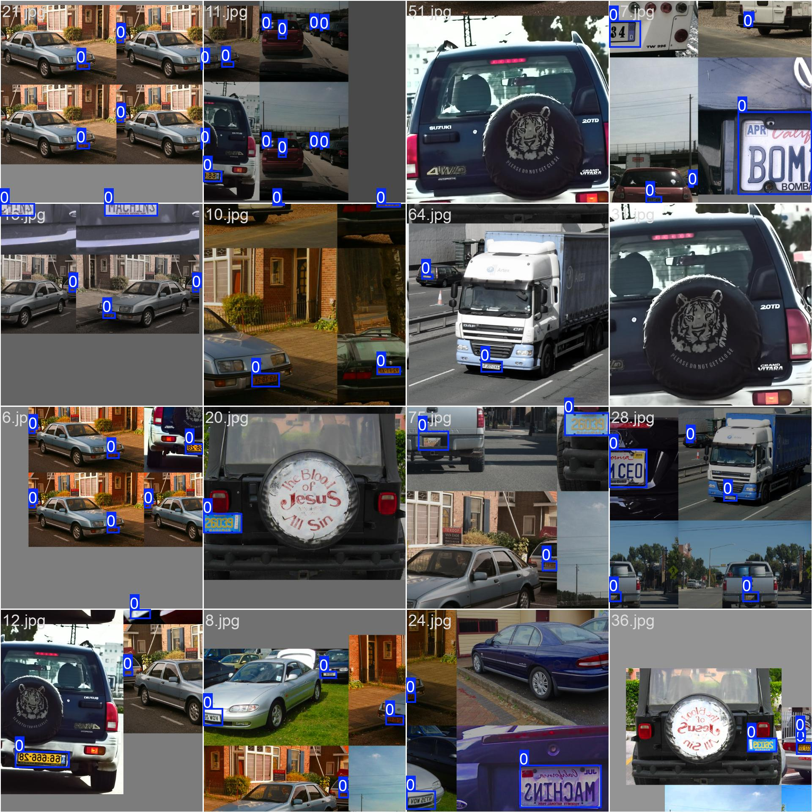
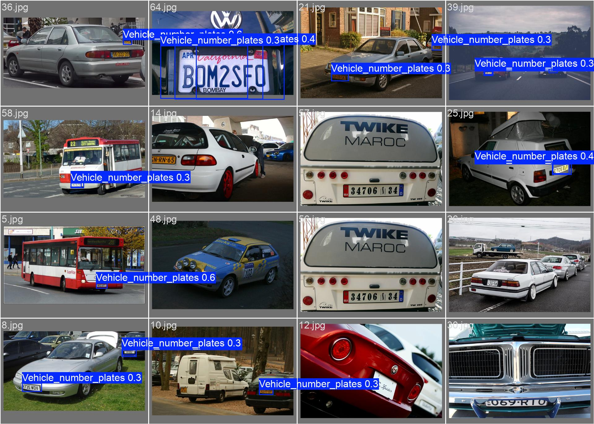

# 🚗 Object Detection (YOLO) 

This project contains a trained Yolo11n model for vehicle number plate detection and for this project I downloaded the dataset and annotated it manually.

Dataset Source: [Open Images Dataset – Vehicle Number Plates](https://storage.googleapis.com/openimages/web/visualizer/index.html?type=detection&set=train&c=%2Fm%2F01jfm_)
Annotation Tool: [CVAT (Computer Vision Annotation Tool)](https://www.cvat.ai/)

---
## 👁️ Demo

<table>
  <tr>
    <td style="text-align:center;">
      
      
<strong>traning</strong>

    </td>
    <td style="text-align:center;">
      
      
<strong>Validation</strong>

    </td>
  </tr>
</table>
