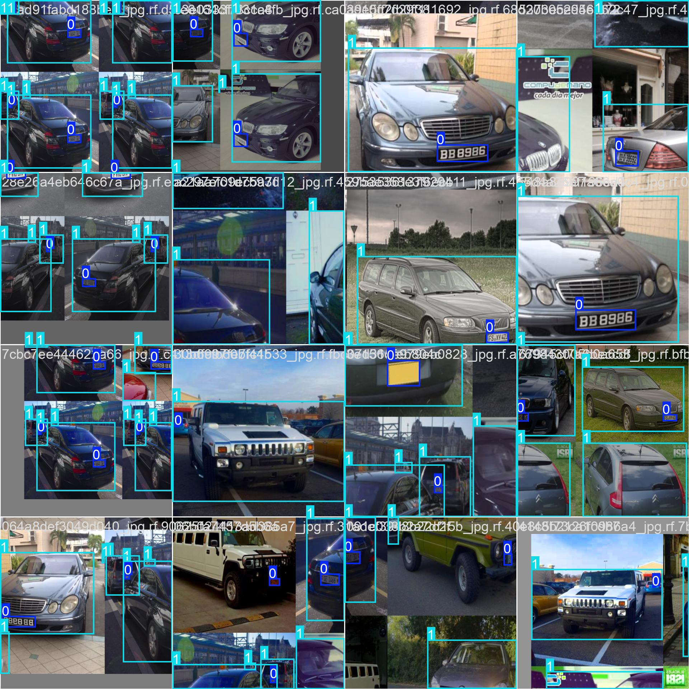

# 🚗 Object Detection

This project is about a trained *Yolo11n* model for **vehicle number plate detection** and for this project I downloaded the dataset and annotated it manually.

Dataset Source: [Open Images Dataset – Vehicle Number Plates](https://storage.googleapis.com/openimages/web/visualizer/index.html?type=detection&set=train&c=%2Fm%2F01jfm_)

Annotation Tool: [Computer Vision Annotation Tool](https://www.cvat.ai/)

---
## 👁️ Demo

<table>
  <tr>
    <td style="text-align:center;">
      
      
<strong>traning</strong>

    </td>
    <td style="text-align:center;">
      
      
<strong>Validation</strong>

    </td>
  </tr>
</table>
<table>
  <tr>
    <td style="text-align:center;">
      
      
<strong>Confusion matrix</strong>

    </td>
    <td style="text-align:center;">
      
      
<strong>losses</strong>

    </td>
  </tr>
</table>

---
# 🖼️ Image Classification (YOLO)

This project demonstrates *YOLO11n-CLS* trained for an **image classification task**.  
The task involves classifying images into four categories ( `lightning`, `rain`, `sandstorm`, `snow`).  

Dataset Source: [Open Images Dataset – Vehicle Number Plates](https://www.kaggle.com/datasets/jehanbhathena/weather-dataset)
---

## 👁️ Demo

<table>
  <tr>
    <td style="text-align:center;">
      
      
<strong>Training Samples</strong>

    </td>
    <td style="text-align:center;">
      
      
<strong>Validation Predictions</strong>

    </td>
  </tr>
</table>

<table>
  <tr>
    <td style="text-align:center;">
      
      
<strong>Confusion Matrix</strong>

    </td>
    <td style="text-align:center;">
      
      
<strong>losses</strong>

    </td>
  </tr>
</table>

